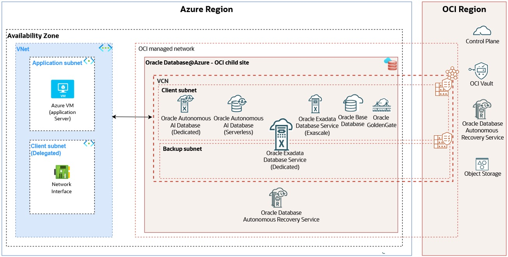

# ExaDB-D Use Cases <!-- omit from toc -->

## **Table of Contents** <!-- omit from toc -->

- [**1. Summary**](#1-summary)
- [**2. Workload Use Cases**](#2-workload-use-cases)
  - [**2.1 ADB-S@Azure Platform**](#21-adb-sazure-platform)
  - [**ADB-S@Azure Groups**](#adb-sazure-groups)
  - [**ADB-S@Azure Monitoring**](#adb-sazure-monitoring)
  - [**2.2 ExaDB-D@Azure Platform**](#22-exadb-dazure-platform)
    - [**ExaDB-D Resources**](#exadb-d-resources)
    - [**ExaDB-D Groups**](#exadb-d-groups)
    - [**ExaDB-D Observability**](#exadb-d-observability)
- [**3. Common Use Cases**](#3-common-use-cases)
  - [**3.1. Autonomous Recovery Service.**](#31-autonomous-recovery-service)
  - [**3.2. Multi-subscription DB Teams.**](#32-multi-subscription-db-teams)
  - [**3.3. Manage Customer-managed database encryption keys with OCI Vault.**](#33-manage-customer-managed-database-encryption-keys-with-oci-vault)
  - [**3.4. High availability between AZs/ADs.**](#34-high-availability-between-azsads)
  - [**3.5. High availability between regions.**](#35-high-availability-between-regions)
  - [**3.6 Basic OCI Exadata Monitoring (Audit Logs, Events, Alarms).**](#36-basic-oci-exadata-monitoring-audit-logs-events-alarms)
  - [**3.7 Advanced OCI Database Observability (DBM, OPSI, LA).**](#37-advanced-oci-database-observability-dbm-opsi-la)
  - [**3.8 Database Audit Logs (OCI Data Safe).**](#38-database-audit-logs-oci-data-safe)
  - [**3.9 OCI Workloads connecting to OD@ Databases.**](#39-oci-workloads-connecting-to-od-databases)
- [**4. Design Decisions**](#4-design-decisions)
- [**5. Management of other resources**](#5-management-of-other-resources)
  - [**5.1 Disaster Recovery (DR)**](#51-disaster-recovery-dr)
  - [**5.2 Software Images**](#52-software-images)

## **1. Summary**

The OD@Azure is a cloud service that is physically located and runs from Azure datacenters. The service use a combination of Azure and OCI Control Planes to manage the different components of the service. You have the choice to use some services from Azure or OCI, depending on your preferences or best available solution.

In this Workload Extension we'll cover some of the different Oracle Database deployment options that can be deployed as part of the service. We refer to these deployment options as Workload Use Cases (WUCs). You can select the service most suitable for your needs. Objective of the Workload Extension is that you have everything you need to setup a secure environment, scalable and based on best-practices environment.

The Workload Extension also explains some scenarios where typically you need to use additional OCI resources based on your requirements. These additional resources can be related to security, networking, monitoring, backup or use OD@Azure with another OCI workloads. These elements need to have an OCI Landing Zone to be able to govern in a secure and scalable way. They are common building blocks between Azure, Google Cloud and AWS, so they're considered addons in the OCI Landing Zone framework.

In this Landing Zone Workload Extension, we provide examples of common scenarios that customers typically encounter, along with guidance on how the available templates can be used to implement solutions tailored to specific requirements.

This section is intended to guide you through several of these scenarios.

At the time of writing this documentation, Oracle Database@Azure supports the following workloads:

This document is focused, for now, in the following **Workload Use Cases (WUCs)**:

1) **WUC1 | ADB-S@Azure Platform: Dedicated serverless Oracle AI Database.**
2) **WUC2 | ExaDB-D@Azure Platform: Shared infrastructure with dedicated VM-Clusters.**

While not all possible configurations are covered, these represent the most common scenarios. If your use case involves a combination of these, you can leverage elements from each to design a custom solution.

Autonomous AI Database Serverless (ADB-S) is Oracle’s fully managed cloud database service that runs on Oracle Exadata infrastructure. The “Serverless” model means Oracle automatically manages the database infrastructure, including provisioning, patching, backups, tuning, scaling, and maintenance, so users can focus on applications and data, rather than database administration. It has a low operational cost.

The ExaDB-D infrastructure consists of database and storage servers connected through a RoCE switch fabric. It supports both "regular" *Virtual Machine Clusters (VMCs)* and *Autonomous Virtual Machine Clusters (AVMCs)*. Each VMC/AVMC is composed of one or more virtual machines distributed across database servers, ensuring high availability through Oracle Grid Infrastructure clusterware.

On top of regular VMCs, you can deploy multiple *Oracle Homes (OHs)*, which are used to create and run *Oracle Container Databases (CDBs)*. Each CDB can host multiple *Pluggable Databases (PDBs)*.

In OD@Azure you can't select the compartment where any component is going to be deployed (ADB-S, VMCs, CDBs or PDBs). They are organized depending on the subscription ID used in Azure, and in OCI will be present in a compartment with the subscription ID inside the top level MulticloudLink_ODBAA compartment. Default [RBAC](https://docs.oracle.com/en-us/iaas/Content/database-at-azure/onboard-access-control.htm) groups are created during the link process. 

This workload extension adds the possibility to create MultiSubscription limited groups to create finer separation of duties in your organization, limiting the access only to the database components withing the team subscription.

Although it is possible to fine-tune IAM policies to grant access to specific OHs, CDBs, or PDBs using tags, this approach requires significant effort after deployment and can be difficult to maintain over time.

Similarly, AVMCs can be created on top of an ExaDB-D infrastructure. Within each AVMC, you can create multiple *Autonomous Container Databases (ACDs)*, and within each ACD, multiple *Autonomous Databases Dedicated (ADB-D)*. 

By default, IAM policies created during the OD@ link, grants permissions to all the groups to the different groups over the *"MultiCloudLink_ODBAA_<link_date>"* enclosing compartment, meaning that, even if you use multiple Azure subscriptions, the same DB administrators will get access to each OCI subscription-level compartment. As many organizations use the Azure subscriptions to isolate and separate different teams workload scope, we facilitate here the same as a Common Use Case (CUC) to manage these sub-compartments with Tag-Based Access Controls (TBAC), by assigning some tags to the compartments and also the new groups, reusing a template policy that only grants to the DB team tagged with the compartment tags the needed permissions that allows to manage its resources, not others.

&nbsp;

## **2. Workload Use Cases**

In this section, we describe the identified workload use case scenarios, providing additional guidance on key aspects such as the **separation of duties** across operations teams and the **architectural design decisions** involved in placing resources and ExaDB-D components.

1) **WUC1 | ADB-S@Azure Platform: Dedicated serverless Oracle AI Database.**
2) **WUC2 | ExaDB-D@Azure Platform: Shared infrastructure with dedicated VM-Clusters.**

&nbsp;

### **2.1 ADB-S@Azure Platform**

Oracle Autonomous Database Serverless on Azure (ADB-S@Azure) is a fully managed, self-driving Oracle Database service running on Oracle Database@Azure, enabling organizations to deploy Oracle Autonomous Database directly within Microsoft Azure datacenters while integrating seamlessly with the Azure ecosystem. It automates provisioning, patching, tuning, scaling, backups, security, and high availability, allowing engineering teams to focus on application development instead of database administration. Customers can provision databases for transactional, analytics, JSON, or APEX workloads in minutes, with independent, elastic scaling of compute and storage and consumption-based pricing. 

An overall architecture of the Workload Use Case can be seen below:

&nbsp;

### **ADB-S@Azure Groups**

Default Azure RBAC and OCI groups need to be setup manually. If you federate OCI with your Azure Entra ID (or alternative Identity Provider), OCI groups provisioning is not needed.

The groups to provisioned are documented [here](https://docs.oracle.com/en-us/iaas/Content/database-at-azure/onboard-access-control.htm#autonomous-groups-roles).

The Azure roles and OCI groups to be created are:

| Azure Group Name | Azure Role Assignment | Purpose |
| --- | --- | --- |
| `odbaa-adbs-db-administrators` | Oracle.Database Autonomous Database Administrator | This group is for administrators who need to manage all Oracle Autonomous Database resources in Azure. |
| `odbaa-db-family-administrators` | None | This group is replicated in OCI during the optional identity federation process. This group is for administrators who need to manage all Oracle Database Service resources in OCI. |
| `odbaa-db-family-readers` | Oracle.Database Reader | This group is replicated in OCI during the optional identity federation process. This group is for readers who need to view all Oracle Database resources in OCI. |
| `odbaa-network-administrators` | None | This group is replicated in OCI during the optional identity federation process. This group is for administrators who need to manage all network resources in OCI. |
| `odbaa-costmgmt-administrators` | None | This group is replicated in OCI during the optional identity federation process. This group is for administrators who need to manage cost and billing resources in OCI. |

Notice that, as part of the azure account linking, OCI policies are created automatically expecting those groups.

&nbsp;

### **ADB-S@Azure Monitoring**

ADB-S@Azure provide out-of-the-box monitoring through Azure Monitor, allowing to use native Azure dashboards, metrics, alerts, action groups, and workbooks without deploying additional monitoring agents. Azure Monitor is integrated into the Oracle Database@Azure experience and exposes health and performance metrics directly in the Azure portal.

This workload extension do not configure Azure Monitoring resources.

While OCI Basic monitoring services can be used, they don't bring differences to Azure ones.

You can find how to use them [here](https://docs.oracle.com/en-us/iaas/Content/database-at-azure/azumn-monitor-azure-monitor.html#).

&nbsp;

### **2.2 ExaDB-D@Azure Platform**

Oracle Exadata Database Service on Dedicated Infrastructure for Azure (ExaDB-D@Azure) is a customer-dedicated Oracle Database service running on Oracle Exadata infrastructure through Oracle Database@Azure, designed for organizations that require maximum performance, isolation, and administrative control for mission-critical Oracle workloads. It enables customers to provision dedicated Exadata infrastructure and VM clusters from the Azure experience while leveraging Oracle’s industry-leading Exadata platform for extreme OLTP, analytics, mixed workloads, and database consolidation. 

Engineering teams retain full control over database versions, patching schedules, configuration, and resource allocation, while benefiting from automated infrastructure management, elastic scaling of compute and storage, built-in high availability, and advanced security. 

An overall architecture of the Workload Use Case can be seen below:

&nbsp;

#### **ExaDB-D Resources**

In ExaDB-D@Azure, Exadata Infrastructure will belong to an Azure subscription. The infrastructure can hold a mix of VM Clusters (VMC) and Autonomous VM Clusters (AVMC) that belongs to the same or different Azure subscriptions. This means that the Exadata Infrastructure is a shared platform resource, governed by the default created group or to dedicated subscription group in Multi-Subscription model.

Regular Virtual Machine Clusters (VMCs), along with their associated Oracle Homes (OHs), Container Databases (CDBs), and Pluggable Databases (PDBs) are all deployed within the same ExaDB-D OCI subscription compartment, as these resources cannot be distributed across multiple compartments.

&nbsp;

#### **ExaDB-D Groups**

Default Azure RBAC and OCI groups need to be setup manually. If you federate OCI with your Azure Entra ID (or alternative Identity Provider), OCI groups provisioning is not needed.

The groups to provisioned are documented [here](https://docs.oracle.com/en-us/iaas/Content/database-at-azure/onboard-access-control.htm#exeadata-db-dedicated-inra-groups-roles).

The Azure roles and OCI groups to be created are:

| Azure Group Name | Azure Role Assignment | Purpose |
| --- | --- | --- |
| `odbaa-exa-infra-administrators` | Oracle.Database Exadata Infrastructure Administrator | This group is for administrators who need to manage all Exadata Database Service resources in Azure. Users with this role have all the permissions granted by `odbaa-vm-cluster-administrators`. |
| `odbaa-vm-cluster-administrators` | Oracle.Database VmCluster Administrator | This group is for administrators who need to manage VM cluster resources in Azure. |
| `odbaa-db-family-administrators` | None | This group is replicated in OCI during the optional identity federation process. This group is for administrators who need to manage all Oracle Database Service resources in OCI. |
| `odbaa-db-family-readers` | Oracle.Database Reader | This group is replicated in OCI during the optional identity federation process. This group is for readers who need to view all Oracle Database resources in OCI. |
| `odbaa-exa-cdb-administrators` | None | This group is replicated in OCI during the optional identity federation process. This group is for administrators who need to manage all CDB resources in OCI. |
| `odbaa-exa-pdb-administrators` | None | This group is replicated in OCI during the optional identity federation process. This group is for administrators who need to manage all PDB resources in OCI. |
| `odbaa-network-administrators` | None | This group is replicated in OCI during the optional identity federation process. This group is for administrators who need to manage all network resources in OCI. |
| `odbaa-costmgmt-administrators` | None | This group is replicated in OCI during the optional identity federation process. This group is for administrators who need to manage cost and billing resources in OCI. |

Notice that, as part of the azure account linking, OCI policies are created automatically expecting those groups.

&nbsp;

#### **ExaDB-D Observability**

ExaDB-D@Azure provide out-of-the-box monitoring through Azure Monitor, allowing to use native Azure dashboards, metrics, alerts, action groups, and workbooks without deploying additional monitoring agents. Azure Monitor is integrated into the Oracle Database@Azure experience and exposes health and performance metrics directly in the Azure portal.

This workload extension do not configure Azure Monitoring resources.

While OCI Basic monitoring services can be used, they don't bring differences to Azure ones.

You can find how to use them [here](https://docs.oracle.com/en-us/iaas/Content/database-at-azure/azumn-monitor-azure-monitor.html#).

&nbsp;

## **3. Common Use Cases**

1) **CUC1 | Autonomous Recovery Service.**
2) **CUC2 | Multi-subscription DB Teams.**
3) **CUC3 | Manage Customer-managed database encryption keys with OCI Vault.**
4) **CUC4 | High availability between AZs/ADs.**
5) **CUC5 | High availability between regions.**
6) **CUC6 | Basic OCI Exadata Monitoring (Audit Logs, Events, Alarms).**
7) **CUC7 | Advanced OCI Database Observability (DBM, OPSI, LA).**
8) **CUC8 | Database Audit Logs (OCI Datasafe).**
9) **CUC9 | OCI Workloads connecting to OD@ Databases.**

&nbsp;

### **3.1. Autonomous Recovery Service.**

This Common Use Case applies when we want to perform Oracle Database backups to [**Autonomous Recovery Service (ARS)**](https://docs.oracle.com/en-us/iaas/recovery-service/index.html).

Autonomous Recovery Service (ARS) is an Oracle-managed, cloud-native data protection service that automates database backup, validation, and recovery for Oracle databases. It continuously protects data with immutable, encrypted backups and recovery automation, helping organizations minimize data loss and downtime. ARS simplifies backup administration while strengthening cyber resilience and meeting enterprise recovery objectives.

We can see an example of the use of ARS in the diagram below (ExaDB-D WUC):

In OD@Azure, ARS service is physically present in OCI. OD@Azure workloads can perform backup against it thanks to the existing interconnect, completely managed, between Azure and OCI. The service can be accessed through the Oracle Service Network (OSN) and, to be able to connect to Oracle Databases in Azure, it requires network connectivity. That's why, the creation of a Private Endpoint (PE) is needed. This PE is attached to the shadow VCN created during the OD@Azure on-boarding (VNet delegated subnet) present in OCI.

For ADB-S@Azure, the PE is created in the client subnet (the only existing one), while in the ExaDB-D@Azure, it is created in the backup subnet to don't affect to client traffic during backups.

To on-board ARS, it is needed to:

1) IAM Policy to manage the service to the corresponding DBA group.
2) Network connectivity is configured, private endpoint and Network Security Group (NSGs).

After configuring the ARS service, the databases backup can be configured to use it.

To access to the **Autonomous Recovery Service AddOn** click [here]().

&nbsp;

### **3.2. Multi-subscription DB Teams.**

Oracle Database@Azure [**Multi-Subscription**](https://docs.oracle.com/en-us/iaas/Content/database-at-azure/oaa-multiple-subscriptions.htm) is deployment model that enables organizations to provision and manage Oracle Database@Azure resources across multiple Azure subscriptions while maintaining centralized governance, consistent security policies, and delegated administration. It allows different database teams or business units to operate independently within their own subscriptions while sharing a common Oracle Database@Azure environment and enterprise controls.

You can also access to complementary Microsoft documentation on using OD@Azure to multiple Azure subscriptions [here](https://learn.microsoft.com/azure/oracle/oracle-db/link-oracle-database-multiple-subscription).

We can see an example of the using Multi-subscription DB teams below (ExaDB-D WUC):

To use Multi-Subscription, a new database administration group is created, in the external Identity Provider or in the Azure Entra ID and OCI Identity Domain if federation is not used. An IAM policy is needed to grant that group the capability to use Oracle Database resources in OCI compartment for the specific subscription (instead of the whole MultiCloud Link compartment). In order to have a better efficient and scalable approach for these teams, we're using here a Tab-Based Access Control IAM policies as templates.

You can access the **Multi-Subscription AddOn** by clicking [here]().

&nbsp;

### **3.3. Manage Customer-managed database encryption keys with OCI Vault.**

OCI Vault **Customer-Managed Keys (CMK)** for Oracle Database@Azure enable organizations to retain ownership and control of the Transparent Data Encryption (TDE) master encryption keys used to protect database data at rest. By storing keys in OCI Vault, customers gain centralized key lifecycle management, including key rotation, auditing, access control through OCI IAM, and support for HSM-backed keys, helping meet security, compliance, and regulatory requirements while maintaining seamless integration with Oracle Database@Azure.  

Additional information about how to protect ExaDB-D databases can be found [here](https://docs.oracle.com/en-us/iaas/Content/database-at-azure/azusr-security-protect-exadata-database.html?utm_source=chatgpt.com#cmk%20-%20oci%20vault).

Additional information about how to protect ADB-S databases can be found [here](https://docs.oracle.com/en-us/iaas/Content/database-at-azure/azusr-security-protect-autonomous-ai-database.html#cmk%20-%20oci%20vault).

We can see an example of using OCI Vault for Oracle Databases customer managed keys below (ExaDB-D WUC):

The use of OCI Vault requires that Landing Zone provides:

1) An OCI compartment where to deploy the OCI Vault as a shared security service.
2) An OCI security admin groups who manage the OCI Vault.
3) OCI IAM policies and permissions to allow database administrators to access and use the vault and encryption key for TDE operations.

You can access the **OCI Vault AddOn** by clicking [here]().

&nbsp;

### **3.4. High availability between AZs/ADs.**

High Availability Across Availability Zones (AZs)/Availability Domains (ADs) in Oracle Database@Azure (also known as [MAA Gold DR Architecture](https://docs.oracle.com/en/database/oracle/oracle-database/21/haovw/oracle-maximum-availability-architecture-oracle-databaseazure.html#HAOVW-GUID-7A38AFBF-0184-46EA-ACB1-1188BBAA2B67)) provides resilience against datacenter or infrastructure failures by distributing Oracle Database resources across physically separate Availability Domains (OCI) or Availability Zones (Azure region dependent). Combined with Oracle technologies such as Oracle Real Application Clusters (RAC) and Data Guard, this architecture enables automatic failover, minimizes downtime, and helps maintain business continuity for mission-critical workloads during planned maintenance or unexpected outages.

We can see an example of using high availability between AZs/ADs below (ExaDB-D WUC):

To be able to use the high availability between AZs/ADs it is required to create Local Peering Gateways in the OCI shadow VCNs used by the VM Clusters where the databases to protect run, and modify the VCNs routing to allow the traffic flow between them.

Additional information about how to manually setup is available [here](https://docs.oracle.com/en/database/oracle/oracle-database/21/haovw/oracle-maximum-availability-architecture-oracle-databaseazure.html#HAOVW-GUID-A70E5061-056A-4107-A1DC-2D43A24B792B).

The **High availability between availability domains AddOn**, which automates and shows you how to run this can be accessed from [here]().

&nbsp;

### **3.5. High availability between regions.**

High Availability Across Regions in Oracle Database@Azure (also known as [MAA Gold DR Architecture Across Two Azure/OCI Regions](https://docs.oracle.com/en/database/oracle/oracle-database/21/haovw/oracle-maximum-availability-architecture-oracle-databaseazure.html#HAOVW-GUID-7A38AFBF-0184-46EA-ACB1-1188BBAA2B67)) provides disaster recovery and business continuity by maintaining synchronized standby databases in one or more geographically separate Azure/OCI region pairs using Oracle Data Guard or Oracle Active Data Guard. In the event of a regional outage, workloads can be quickly switched or failed over to a standby database in another region, minimizing downtime and data loss while supporting stringent Recovery Time Objectives (RTO) and Recovery Point Objectives (RPO) for mission-critical applications. 

We can see an example of using high availability between regions below (ExaDB-D WUC):

Additional information about how to manually setup is available [here](https://docs.oracle.com/en/solutions/multi-region-standby-dr-db-at-azure/#GUID-5B650E47-B6D9-4DA4-9038-AB9F4F19631E).

The **High availability between regions AddOn**, which automates and shows you how to run this can be accessed from [here]().

&nbsp;

### **3.6 Basic OCI Exadata Monitoring (Audit Logs, Events, Alarms).**

>[!IMPORTANT]
> Exadata events & alarms available OOTB in Azure. OCI Audit logs not present, check with integration patterns.

### **3.7 Advanced OCI Database Observability (DBM, OPSI, LA).**

OCI Database Management (DBM), Operations Insights (OPSI), and Log Analytics (LA) extend the native Azure Monitor capabilities with deep Oracle-specific observability, diagnostics, and predictive analytics. While Azure Monitor provides infrastructure health, metrics, logs, dashboards, and alerting, OCI’s management services add advanced features such as SQL performance analysis, Performance Hub, AWR and ASH diagnostics, fleet administration, capacity planning, workload forecasting, anomaly detection, log correlation, and AI-assisted root cause analysis. Together, they enable database administrators to proactively optimize performance, troubleshoot complex issues, and improve the operational efficiency of Oracle database environments beyond basic monitoring.

We can see an example of using Advanced OCI Database Observability services below (ExaDB-D WUC):

To be able to use these advanced services, Landing Zones needs to provide:

1) OCI shared compartments where to deploy the required resources for monitoring platform.
2) OCI shared compartment for required OCI network resources.
3) OCI IAM groups for monitoring team and the services.
4) OCI IAM policies for observability and networking teams.
5) Hub VCN and subnet where to deploy the monitoring private endpoints that advanced services will use.
6) LPG in OCI shadow VCN and hub VCN and needed routing to communicate each other.
7) DBM, OPSI private endpoints.
8) Network security group security rules needed in shadow and hub VCN to allow private endpoints communication with target databases.
   
The **Advanced OCI Database Observability AddOn**, which automates and shows you how to run this can be accessed from [here]().

&nbsp;

### **3.8 Database Audit Logs (OCI Data Safe).**

OCI Data Safe enhances the security and compliance of Oracle Database@Azure deployments by providing a centralized security management platform for Oracle databases. Beyond basic monitoring, it enables Security Assessment, User Assessment, Sensitive Data Discovery, Data Masking, Activity Auditing, SQL Firewall, and real-time security alerts. These capabilities help organizations identify security risks, protect sensitive data, detect suspicious database activity, and meet regulatory compliance requirements across their Oracle database fleet.

We can see an example of using OCI Data Safe below (ExaDB-D WUC):

To be able to use OCI Data Safe, Landing Zones needs to provide:

1) OCI shared security compartment for security team, managing Data Safe.
2) OCI security group for OCI security administrators.
3) OCI IAM policy to allow security team to manage Data Safe components.
4) OCI IAM policy to allow DB administrators to use Data Safe with Azure Oracle Databases.
5) OCI Shared hub VCN with subnet where to deploy Data Safe private endpoint.
6) Shadow and Hub VCN Local Peering Gateways and routing to allow Data Safe and target databases communication.
7) Dedicated Data Safe Network Security Group and security rules to connect to target databases.

With previous elements, Data Safe service can be enabled and configured.

The **Data Safe AddOn**, which automates and shows you how to run this can be accessed from [here]().

&nbsp;

### **3.9 OCI Workloads connecting to OD@ Databases.**

When it is needed to interconnect OCI workloads with OD@Azure databases, a complete OCI Landing Zone is needed (or it is pre-existing).

This Common Use Case propose the use of an OCI Operating Entities Landing Zone and how to connect with OD@Azure.

We can see an example architecture below (ExaDB-D WUC):

## **4. Design Decisions**

This section outlines the key design decisions adopted for the ExaDB-D architecture, covering administrative responsibilities, resource placement, visual representation, and networking strategy.

**Administrative Model**

The administrative model is structured across three levels: global, environment, and project, enabling a consistent separation of responsibilities across the platform. The presence and scope of these administrative groups may vary depending on the selected use case.

At the global level, centralized teams are defined:

- **Global Infra Admin Team**, responsible for the management and maintenance of ExaDB-D infrastructure components across the Landing Zone.
- **Global DBA Team**, responsible for governance, standards, and administration of shared database-related components.

At the environment level, dedicated teams are defined per environment:

- **Env Infra Admin Team (per environment)**, responsible for infrastructure operations within the environment, including VMCs and AVMCs.
- **Env DBA Team (per environment)**, responsible for database administration within the environment, including Oracle Homes (OHs), CDBs, PDBs, and ACDs.

At the project level, administration is limited to database ownership:

- **Project DBA Team (per project)**, responsible exclusively for managing ADB-D databases within their respective project compartments.

This model enforces a multi-level separation of duties, aligning operational ownership with the scope of each resource.

**Visual Representation (Diagram Interpretation)**

The architecture diagrams use a color-based convention to represent the scope of resources:

- Dark-colored elements represent globally shared components, managed at the global level.
- Light-colored elements represent environment-specific (dedicated) resources, regardless of the environment (e.g., Production or Pre-Production).

This visual distinction allows quick identification of level of isolation (global vs environment).

**Networking Strategy**

Networking for ExaDB-D is designed to align with infrastructure constraints while enabling reuse and flexibility across environments.

VMC Networks must be created within the ExaDB-D Infrastructure compartment, as they cannot reside in a different compartment from the infrastructure itself. Each VMC requires connectivity to on-premises networks through both client VLANs, used for application traffic, and backup VLANs, used for backup and replication purposes. These VLANs are trunked through the database server network interfaces.

In this design, separate VLANs are typically defined for Primary (PROD) and Disaster Recovery (DR) environments. However, depending on the customer’s network architecture, VLANs may be extended across data centers or availability locations, allowing the same VLANs to be reused across multiple ExaDB-D infrastructures.

Although each VMC requires its own VMC Network resource, this does not imply that network segmentation must be unique per cluster. Multiple VMCs and AVMCs can share the same backend subnets and VLANs when operating within the same network domain. This enables efficient reuse of network configurations across environments and projects while still complying with ExaDB-D networking requirements.

This approach ensures consistency, optimizes network resource utilization, and aligns with enterprise networking standards while respecting platform constraints.

**Resource Placement Strategy**

A key design decision in this architecture is how database resources are placed and managed, taking into account the inherent differences between regular database deployments (VMC-based) and Autonomous Database deployments.

In the case of regular database clusters, the placement model is inherently constrained by the platform. A VMC, together with its associated Oracle Homes (OHs), Container Databases (CDBs), and Pluggable Databases (PDBs), must be deployed within a single compartment, and all dependent resources must remain within that same boundary. Since PDBs cannot be placed outside of their parent CDB and VMC, the cluster effectively defines both the administrative and placement scope. This means that any level of isolation or delegation must be defined at the level where the VMC is deployed (for example, global or environment level), as finer granularity at the database level is not possible.

In contrast, Autonomous Databases Dedicated (ADB-D) provide a fundamentally different model. Although they are hosted within AVMC/ACD structures, they can be deployed in independent compartments, separate from the underlying infrastructure components. This introduces true flexibility at the database level, allowing each database to be aligned with a specific ownership and operational boundary.

Based on this capability, a deliberate design decision has been made to always deploy Autonomous Databases at the project level. This ensures that each ADB is associated with its corresponding project compartment, enabling clear ownership, fine-grained access control, and independent lifecycle management.

By combining these two approaches, the architecture acknowledges the structural constraints of VMC-based deployments—where the cluster defines the boundary—while leveraging the flexibility of Autonomous Databases to achieve project-level isolation and delegation.

## **5. Management of other resources**

### **5.1 Disaster Recovery (DR)**

In this architecture, Disaster Recovery (DR) is implemented by defining two ExaDB-D infrastructures, one acting as primary and the other as standby.

Database protection is implemented using Data Guard, with associations established between database clusters running on different infrastructures. This ensures that each workload is replicated across independent platforms, providing resilience and continuity in case of failure.

From an operational perspective, Production and DR resources are typically managed by the same administrative teams, following the administrative model defined for the Landing Zone.

Cost allocation between primary and DR deployments can be managed through the use of OCI tags, applied consistently to the corresponding infrastructure and database resources.

This approach provides a consistent and scalable DR model, where protection is based on databases located in different VM clusters, running on separate ExaDB-D infrastructures, replicating database information between CDBs, while maintaining flexibility in terms of logical organization, cost tracking, and operational ownership.

To know more about how to use Data Guard on ExaDB-D environments you can check the public document [Oracle Maximum Availability Architecture for Oracle Database@Azure
](https://docs.oracle.com/en/database/oracle/oracle-database/19/haovw/oracle-maximum-availability-architecture-oracle-databaseazure.html).

&nbsp;

### **5.2 Software Images**

Oracle provides the capability to define custom Database Software Images and Grid Infrastructure Software Images in OCI. These images represent curated versions of Oracle software, including specific Release Updates (RUs) and optional one-off patches, allowing organizations to standardize the software stack used across their database platforms.

These software images can be leveraged both for provisioning new Oracle or Grid Infrastructure Homes and for performing in-place patching of existing homes, enabling a consistent and controlled approach to software lifecycle management.

In this architecture, the placement of software images is not fixed and depends on the selected use case and operational model. Software images can be managed as shared resources in the MultiCloud Link compartment or in subscription specific sub-compartment, depending on the required level of isolation and governance.

When a shared model is adopted, software images are typically placed in MultiCloud Link compartment, allowing reuse across multiple environments and supporting a controlled lifecycle promotion model, where versions are validated in non-production environments before being promoted to production.

In contrast, in more isolated models, software images may be placed in subscription-specific compartments, enabling tighter control, independent lifecycle management, and alignment with dedicated operational teams per environment.

IAM policies are defined accordingly to grant the appropriate DBA teams permissions to manage and use these images, ensuring consistency with the overall administrative model.

This flexible approach ensures consistency in software deployment while allowing the architecture to adapt to different organizational, operational, and governance requirements.

For more information, refer to the official documentation [Manage Software Images](https://docs.oracle.com/en-us/iaas/exadatacloud/doc/ecc-manage-images.html?).

&nbsp;

# License <!-- omit from toc -->

Copyright (c) 2026 Oracle and/or its affiliates.

Licensed under the Universal Permissive License (UPL), Version 1.0.

See [LICENSE](/LICENSE.txt) for more details.
